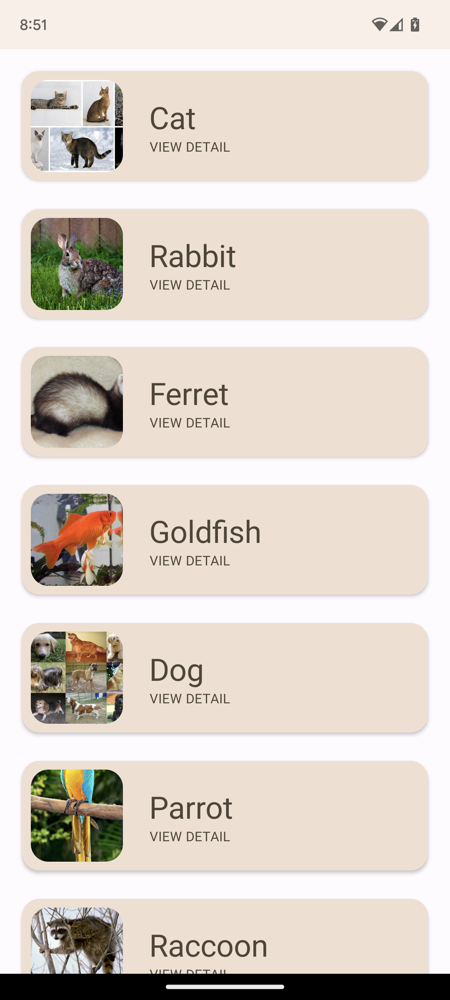
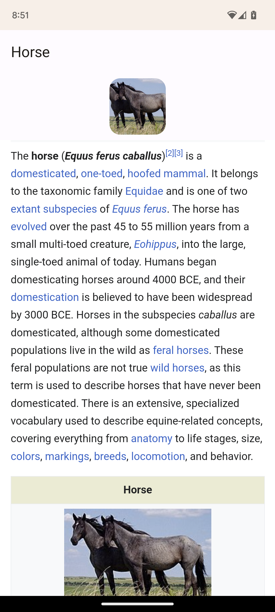
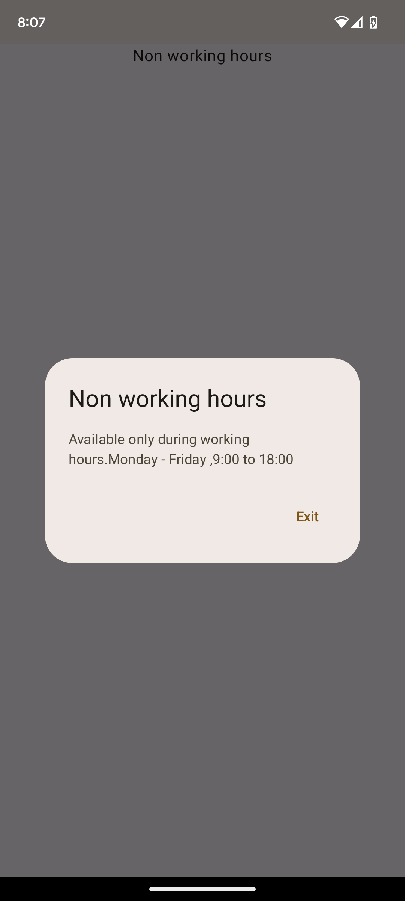
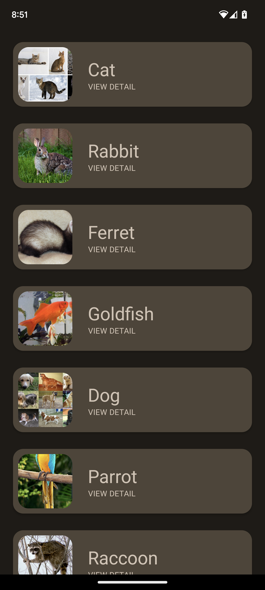

# Android MVVM Architecture: Sepia Pet's app
This repository contains a detailed sample app that implements MVVM architecture.

## Requirement
Requirements Android SDK version 21 or later

## Notes:
- Used MVVM Design pattern.
- Used Jetpack Compose UI.
- ui: View classes along with their corresponding ViewModel.
- repository: It contains logic to fetch data currently its fetching from local json, but it can be scale easily but adding api logic other app component will work smoothly.
- model: It contains data classes.
- Utility: Utility classes.

## ScreenShots:

  
   
  
  

